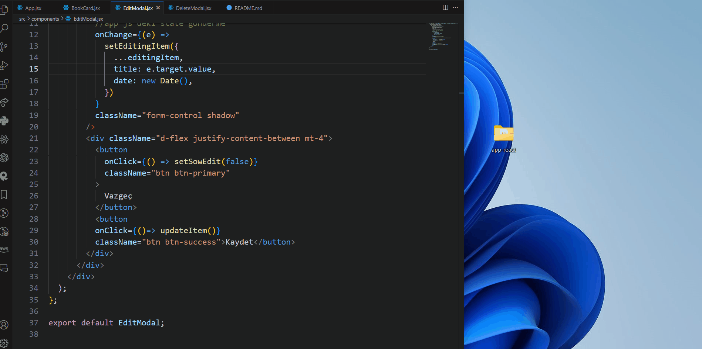

# CRUD APP

- - Create Read Update Delete
- - Oluştur oku Düzenle Sil

*  Form içerisinden kitap ismini al
- - Eğre kitap ismi eklenmişse
- - Ekle butonuna tıklanınca kitap ismiyle yeni bir obje oluştur
- - Ekleme tarihi | Kitap ismi | id | okundu Mu
- - Oluşan objeyi kitaplrı tuttuğumuz State'e aktar
- - İmputu Temizle

* `books` state'inde tutulan kitapları al ve ekran bas
* - Eğer state boş ise "Henüz kitap eklenmedi " ekranına bas
* - Dizideki her kitap için ekrana `BooksCard` birleşeni bas
* - `BooksCard`'a prop olarak ekrana basılacak kitap bilgilerini aktar

* - ``Kitap silme``
* - Herhangi bir kitabın sil butonuna tıklandığında fonk. çalıştır.
 * - fonksiyon silinecek id'sine gönder
 * - bu fonk. ekran modal'ı açsın
 * - ve modal'a silinecek ıd gönder

 * - ``Kitap düzenle``
 - - düzenlenecek butonuna tıklandığında

 *- Okundu olarak işaretleme
 - - okundu butonuna tıklayınca fonksiyonu çalıştır
 - - bu fonksiyona kitabın değerini gönder
 - - isRead değerini tersine çevir
 - - State'i güncelle

 # crud-book
